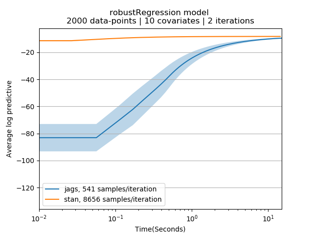

# Readme: Getting Started with PPLBench

## What is PPLBench?

PPLBench is a benchmarking tool for analyzing the performance of various PPLs in context of their ability to implement one or more of the popular Bayesian models. It is designed to be modular so new models and PPL implementations of models can be added into this framework. The fundamental evaluation metric is the average log predictive log likelihood on test set, though more model specific evaluations could be added later.

## How to use PPLBench?

### Installation:

Following is the procedure to install PPLBench on Linux (Tested on Ubuntu 16.04):

1. Download/Clone PPLBench [https://github.com/facebookincubator/BeanMachine/]
2. Installing dependencies:
    1. PPLBench core:
        `pip install -r requirements.txt`
    2. PPLs (Only need to install the ones which you want to benchmark):
        1. Stan:

            `pip install pystan`
        2. Jags:

            `sudo apt-get install jags`

            `sudo apt install pkg-config`

            `pip install pyjags`
        3. pymc3:

            `pip install pymc3`
        4. pyro:

            `pip install pyro-ppl`

### Example:

Let us go through an example to check if the installation is working. From the PPLBench directory, run the following command:

```
python PPLBench.py -m robustRegression -l jags,stan  -k 5 -n 2000 -t 30 --trials 2
```

this should take around 2-4 mins to complete and should produce a result similar to this:



If the plot looks similar, you’re all set!

### Next steps:

* For more information you can look up SPECIFICATIONS.md in the docs folder.
* To see supported models, PPL implementations, usage and optional arguments, type:

```
python PPLBench.py -h
```
