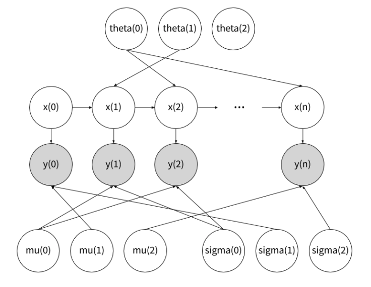
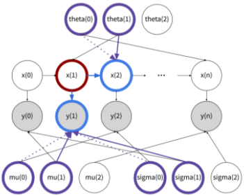

Single-site inference in Bean Machine is a powerful abstraction that allows the inference engine to separately sample values for random variables in your model.

While single-site inference is efficient for many types of models, it may not be suitable for models with highly correlated random variables. To understand this better, let's walk through an example. Let's say we have two random variables $X$, $Y$ whose values are $x$ and $y$, and we'd like to move these values to $x'$ and $y'$. Using [single-site Metropolis-Hastings](framework_topics/inference/ancestral_metropolis_hastings.md), we will move from $(x, y)$ to $(x', y')$ with one of these series of updates:

1. $(x, y) \to (x', y) \to (x', y')$
2. $(x, y) \to (x, y') \to (x', y')$

While this might work, there are times that the move to the intermediate stage (the stage where the values are either $(x', y)$ or $(x, y')$) has a very low acceptance probability. In these cases, we can't move to (x', y') because we can't go through any of the paths above. However, this would have worked fine if we were to directly go from $(x, y) \to (x', y')$. To support this example, the optimal proposal strategy is to group the correlated variables and apply a Metropolis-Hastings update for them together. We refer to this strategy of group updating as _block inference_.

To understand how block inference can be effective, we consider the Hidden Markov Model (HMM) example below.

```py
# alpha, beta, rho, nu, and init are externally-defined constants.

@random_variable
def mu(k):
    return Normal(alpha, beta)

@random_variable
def sigma(k):
    return Gamma(nu, rho)

@random_variable
def theta(k):
    return Dirichlet(kappa)

@random_variable
def x(i):
    if i:
        return Categorical(theta(x(i - 1)))
    return Categorical(init)

@random_variable
def y(i):
    return Normal(mu(x(i)), sigma(x(i)))
```

<!--  -->


This hidden Markov model describes a process with categorical latent states $X$, a transition function $theta$, and emitted values $Y$, whose values are drawn from a Normal distributions that have parameters $\mu$ and $\sigma$ particular to each latent state.

In this model, we only observe the `y`'s and we want to infer the properties of the hidden states `x`'s, `mu`'s and `sigma`'s. Using single-site Metropolis-Hastings, when we propose a new value for `x(1)`, it may change `y(1)`'s parents from `mu(0)` and `sigma(0)` to `mu(1)` and `sigma(1)`. The old samples for `mu(1)` and `sigma(1)` likely no longer explain `y(1)`, so this updated world has a low probability.

We can use block inference to address this low probability. In block inference, we can ask the inference engine to group `x`'s, `mu`'s and `sigma`'s to be updated together. Each block update is performed as explained below.

To perform block inference by blocking together `x`, `mu`, and `sigma`, perform the following:
  1. Propose new `x'` for `x`.
  2. Update the world.
  3. Add the Markov blankets for both `x` and `x'` to `markov_blanket`.
  4. For each `mu` in `markov_blanket`:
    a. Propose new `mu'` for `mu`.
    b. Update the world.
    c. Add the Markov blankets for `mu` and `mu'` to `markov_blanket`.
  5. For each `sigma` in `markov_blanket`:
    a. Propose new value `sigma'` for `sigma`.
    b. Update the world.
    c. Add the Markov blankets for `sigma` and `sigma'` to `markov_blanket`.
  6. Accept / reject _all_ proposed values according to the Metropolis-Hastings acceptance ratio.

Note that the accept / reject step is not performed until blocked variables in the Markov blanket are proposed for.

Going back to the HMM example, let's walk through what happens when we run block inference for `x`, `mu`, and `sigma`. Let's imagine we update the value for `x(1)` from 0 to 1, which will cause `y(1)`'s parents to change from `mu(0)` and `sigma(0)` to `mu(1)` and `sigma(1)`. Now, because we've blocked together `x`, `mu`, and `sigma`, inference will try to update all four of `mu(0)`, `mu(1)`, `sigma(0)`, and `sigma(1)` after `x(1)` and accept/reject all five values together.

Note that the user didn't need to tell the inference engine which `mu` and `sigma` to update along with each `x`. The inference engine itself was able to use the Markov blanket to figure out which `mu`'s and `sigma`'s need to be updated together.

This image shows all of the variables that are jointly updated when updating `x(1)`:

<!--  -->


## Single-site and block inference

Please note that once we enable block inference in Bean Machine, the engine will perform both block and single site updates in each inference iteration, so a single random variable might be updated multiple times in the same inference iteration. We shuffle all blocks before running inference, in order to minimize the influence of any particular way that we process the blocks.

Below is how inference works with block inference enabled for a single iteration of inference:

1. Shuffle all blocks.
2. For each block:
    a. If block is a single node block, perform single-site update
    b. If block is multi node block, perform block update

## Usage

To enable block inference in Bean Machine, users can simply use `add_sequential_proposer` as below.

```py
mh = CompositionalInference()
mh.add_sequential_proposer([x, mu, sigma])
queries = (
    [ x(N-1) ] +
    [ theta(k) for k in range(K) ] +
    [ mu(k) for k in range(K) ] +
    [ sigma(k) for k in range(K) ]
)
obs = { y(i): data[i] for i in range(N) }
samples = mh.infer(queries, obs)
```
