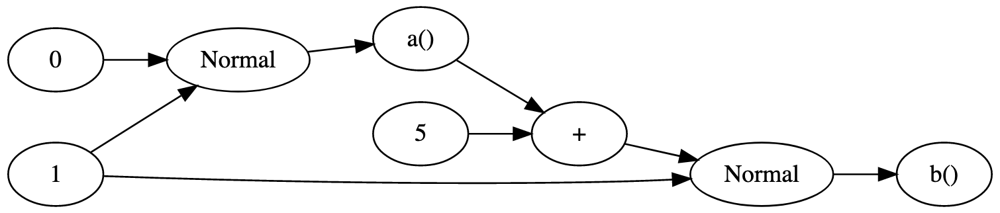

<!-- @import "../../header.md" -->

### What is Bean Machine Graph Inference?

Bean Machine Graph (BMG) inference is an an experimental implementation of inference methods intended for use on restricted models under active development. It uses an internal compiler called Beanstalk which is automatically executed, without users' intervention.

BMG inference relies on a C++ runtime and therefore bypasses Python overhead. Moreover, it is designed specifically to gain significant performance improvements for inference in models restricted in two ways:
- these models are *unvectorized*, that is, their stochastic quantities are tensors which contain exactly one value.
- they are *static*, that is, their corresponding *graph* is the same regardless of the values of random variables’ values. To get a better idea of what a model's graph is and when it is static, see section [Model graphs (static and dynamic)](#graphs) below.

The tutorials currently working with BMG inference are:
- Linear regression;
- Gaussian mixture model [Open in GitHub](https://github.com/facebookresearch/beanmachine/blob/master/tutorials/GMM_with_2_dimensions_and_4_components.ipynb) *•* [Run in Google Colab](https://colab.research.google.com/github/facebookresearch/beanmachine/blob/master/tutorials/GMM_with_2_dimensions_and_4_components.ipynb);
- Neal's funnel [Open in GitHub](https://github.com/facebookresearch/beanmachine/blob/master/tutorials/Tutorial_Sampling_Neal_funnel_in_Bean_Machine.ipynb) *•* [Run in Google Colab](https://colab.research.google.com/github/facebookresearch/beanmachine/blob/master/tutorials/Hidden_Markov_model.ipynb).

For the above three models, the BMG version of [Newtonian Monte Carlo (NMC)](../../framework_topics/inference/newtonian_monte_carlo.md) inference reduces runtime to generate samples of size 10K for the posterior distribution by anywhere between 80 and 250 times depending on the model.

### Model Restrictions

In this release, models accepted by BMG inference have the following restrictions:

- With some exceptions, all tensor quantities manipulated by the model must be single-valued. There is
  some limited support for one- and two-dimensional tensors.
- `@random_variable` functions must return a univariate `Bernoulli`, `Beta`, `Binomial`, `Categorical`,
  `Chi2`, `Dirichlet`, `Gamma`, `HalfCauchy`, `HalfNormal`, `Normal`, `StudentT` or `Uniform(0., 1.)`
  distribution.
- Tensor operators on stochastic values are limited to `add()`, `div()`, `exp()`, `expm1()`,
  `item()`, `log()`, `logsumexp()`, `mul()`, `neg()`, `pow()`, `sigmoid()` and `sub()`.
- Python operators on stochastic values in `@random_variable` or `@functional` functions are limited to
  `+`, `-`, `*`, `/`, and `**` operators. Matrix multiplication and comparisons are not yet supported.
- Support for the `[]` indexing operation is limited.
- Support for "destructuring" assignments such as `x, y = z` where `z` is a stochastic quantity is limited.
- All `@random_variable` and `@functional` functions in the model *and every function called by them*
  must be "pure". That is, the value returned must be logically identical every time the function is
  called with the same arguments, and the function must not modify any externally-observable state.
- Models must not mutate existing tensors "in place"; always create new values rather than mutating
  existing tensors.
- Conditions of `while` statements, `if` statements, and `if` expressions must not be stochastic.

### Using BMG Inference

To use Bean Machine Graph inference on a Bean Machine model, first import the inference engine with the following command: `from beanmachine.ppl.inference.bmg_inference import BMGInference`.

The `BMGInference` class provides the following methods to perform inference and inspect the graph analysis:

- `BMGInference().infer(queries, observations, num_samples, num_chains)` - Computes the static dependency graph and executes
  inference using Bean Machine Graph; returns a dictionary of samples for the queried variables. In the current
  release only Newtonian Monte Carlo (NMC) is supported when running inference with `BMGInference`.
- `BMGInference().to_graphviz(queries, observations)` - Returns a graphviz figure representing the static graph of the model.
- `BMGInference().to_dot(queries, observations)` - Returns the DOT source code of the graphviz static graph.

We have a number of informative error messages that may be emitted that should help you to debug any issues with using BMG inference, but if you happen to (rarely, we hope) encounter any crashes or fails with an unclear error message, please file an issue at https://github.com/facebookresearch/beanmachine/issues.

### Model graphs (static and dynamic) {#graphs}

The *graph* of a model is defined by *nodes* representing the mathematical objects in the model (constants, random variables, results of operations, and distributions), and *edges* representing dependencies in the model. If a quantity node N depends directly on nodes M1, M2, ..., Mk, then there is an edge from each Mi to N.

For an example, consider the Bean Machine model specified in Python below and its corresponding graph.

```py
@random_variable
def a():
    return Normal(0, 1.)

@random_variable
def b():
    return Normal(a() + 5, 1.)
```



This graph is *static* because the dependencies are the same regardless of the *values* involved (for example, `a()` is always a sample of the `Normal(0,1)` distribution regardless of its value).

A graph is *not* static (that is, *dynamic*) if dependencies do change according to random variable values. Consider the following model:

```py
@random_variable
def a(i):
    return Normal(i, 1.)

@random_variable
def index():
     return Poisson(0.3)

@random_variable
def b():
    return Normal(a(index()) + 5, 1.)
```

This model does not have a static graph because the expression `a(index()) + 5` in the last line will depend on different nodes `a(index())`, depending on the value of `index()`.

<FbInternalOnly>

Facebook specific:

 These models are also frequently used at Facebook including Team Power and Metric Ranking products (https://fb.workplace.com/notes/418250526036381) as well as new pilot studies on https://fb.quip.com/GxwQAIscFRz8 and https://fb.quip.com/UMmcAr2zczbc. Additionally, the Probabilistic Programming Languages (https://www.internalfb.com/intern/bunny/?q=group%20pplxfn) (PPL) team has collected a list of https://fb.quip.com/rrMAAuk02Jqa who can benefit from our HME methodology.

BMG: https://fb.quip.com/TDA7AIjRmScW

</FbInternalOnly>
