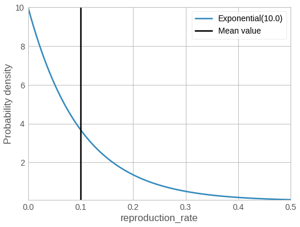

<!-- @import "../../header.md" -->

Inference is the process of combining _model_ with _data_ to obtain _insights_, in the form of probability distributions over values of interest.

A little note on vocabulary: You've already seen in [Modeling](../modeling/modeling.md) that the _model_ in Bean Machine is comprised of random variable functions. In Bean Machine, the _data_ is built up of a dictionary mapping random variable functions to their observed values, and _insights_ take the form of discrete samples from a probability distribution. We refer to random variables that we're learning distributions for as queried random variables.


Let's make this concrete by returning to our disease modeling example. As a refresher, here's the full model:


```py
@bm.random_variable
def reproduction_rate():
    return dist.Exponential(rate=10.0)

@bm.functional
def infection_rate():
    return 1 + reproduction_rate()

@bm.random_variable
def num_cases(day):
    # Base case for recursion
    if day == date(2021, 1, 1):
        return dist.Poisson(num_infected)
    return dist.Poisson(
        infection_rate() *  num_cases(day - datetime.timedelta(days=1))
    )
```


## Prior and Posterior Distributions


<!--  -->

The $\text{Exponential}$ distribution used here represents our beliefs about the disease's reproduction rate before seeing any data, and is known as the _prior distribution_. We've visualized this distribution previously: it represents a reproduction rate that is around 10% on average, but could be as high as 50%, and is highly right-skewed (the right side has a long tail).

Although this encodes our prior beliefs, inference will perform the important task of adjusting the distribution for reproduction rate so that it balances our prior belief with values that are most consistent given observed data. The way this is achieved depends upon the specific inference method used, but it does mean that inferred distributions will blend smoothly from resembling your prior distribution when there is little data observed, to more wholly representing your observed data when there is a lot of observed data. We refer to a distributions over a value of interest computed after conditioning on observed data as a _posterior distribution_.

Throughout this guide, we'll see how observing many days worth of case data will cause inference to fit a posterior distribution that more closely represents the observed data compared to when only a few days of data is observed.

## <a name="binding_data"></a>Binding Data

Inference requires us to bind data to the model in order to learn posterior distributions for your queried random variables. For this example model, we can bind a few days of data with a simple dictionary:

```py
observations = {
    num_cases(datetime.date(2021, 1, 2)): tensor(1381734.),
    num_cases(datetime.date(2021, 1, 3)): tensor(1630446.),
}
```

Recall that calls to random variable functions from ordinary functions (including the Python toplevel) return `RVIdentifier` objects. So, the keys of this dictionary are `RVIdentifiers`, and the values are values of observed data corresponding to each key that you provide. Note that the value for a particular observation must be of the same type as the [support for the distribution that it's bound to](https://pytorch.org/docs/stable/distributions.html#torch.distributions.distribution.Distribution.support). In this case, the [support for the $\text{Poisson}$ distribution](https://pytorch.org/docs/stable/distributions.html#torch.distributions.poisson.Poisson.support) is scalar, so we have bound scalar tensors here.

When you pass this dictionary at inference time, instead of sampling from these random variables, Bean Machine will instead consider these random variables to take on the constant values you've provided in this dictionary, and will try to find values for other random variables in your model that are consistent with the observations that you've provided.

## Running Inference

We're finally ready to run inference! Let's take a look first, and then we'll explain what's happening.

```py
samples = bm.CompositionalInference().infer(
    queries=[ reproduction_rate() ],
    observations=observations,
    num_samples=10000,
    num_chains=4,
)
```

Let's break this down. There is an inference method (in this example, that's the `CompositionalInference` class), and there's a call to `infer()`.

Inference methods are simply classes that extend from `AbstractInference`. These classes define the engine that will be used in order to fit posterior distributions to queried random variables given observations. In this particular example, we've chosen to use the specific inference method `CompositionalInference` to run inference for our disease modeling problem. In short, `CompositionalInference` is a powerful, flexible class for configuring inference in a variety of ways. By default, `CompositionalInference` will select an inference method for each random variable that is appropriate based on its support. For example, for differentiable random variables, this inference method will attempt to leverage gradient information when generating samples from the posterior; for discrete random variables, it will use a uniform sampler to get representative draws for each discrete value.

A full discussion of the powerful `CompositionalInference` inference method, including extensive instructions on how to configure it, can be found in the [Compositional Inference](../../framework_topics/programmable_inference/compositional_inference.md) guide. Bean Machine offers a variety of other inference methods as well, which can perform differently based on the particular model you're working with. You can learn more about these inference methods under the [Inference](../../framework_topics/inference/inference.md) framework topic.

Regardless of inference method, `infer()` has a few important parameters:

| Name | Usage
| --- | ---
| `queries` | A list of random variable functions to fit posterior distributions for.
| `observations` | The Python dictionary of observations that we discussed in [Binding data](#binding_data).
| `num_samples` | The integer number of samples to build up distributions for the values listed in `queries`.
| `num_chains` | The integer number of separate inference runs to use. Multiple chains can be used to verify that inference ran correctly.

You're already seen `queries` and `observations` many times. `num_samples` is used to specify the number of iterations to run inference. More iterations will allow inference to explore the posterior distribution more completely, resulting in more reliable posterior distributions. `num_chains` lets you specify the number of identical runs of inference, called "chains", to perform. Multiple chains of inference can be used to validate that inference ran correctly and was run for enough iterations to produce reliable results. We'll revisit chains in .

---

Now that we've run inference, it's time to explore our results in the [Analysis](../analysis/analysis.mdx) section!
